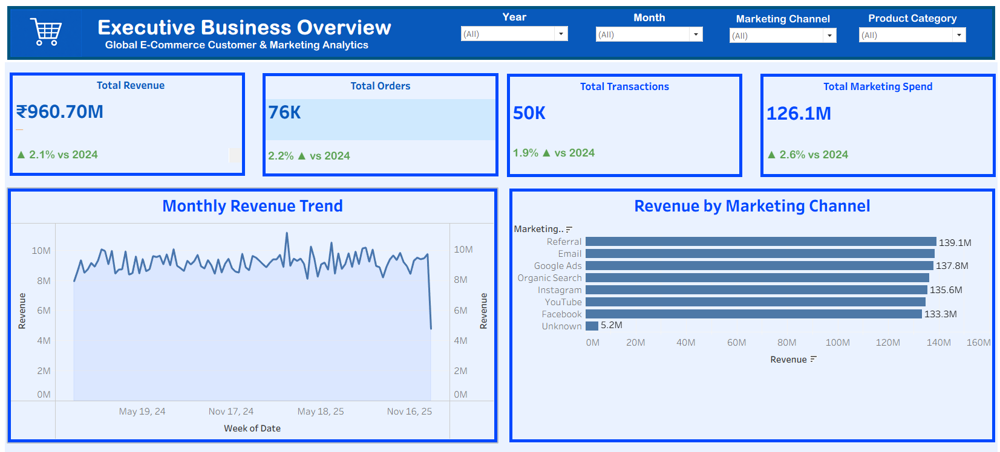
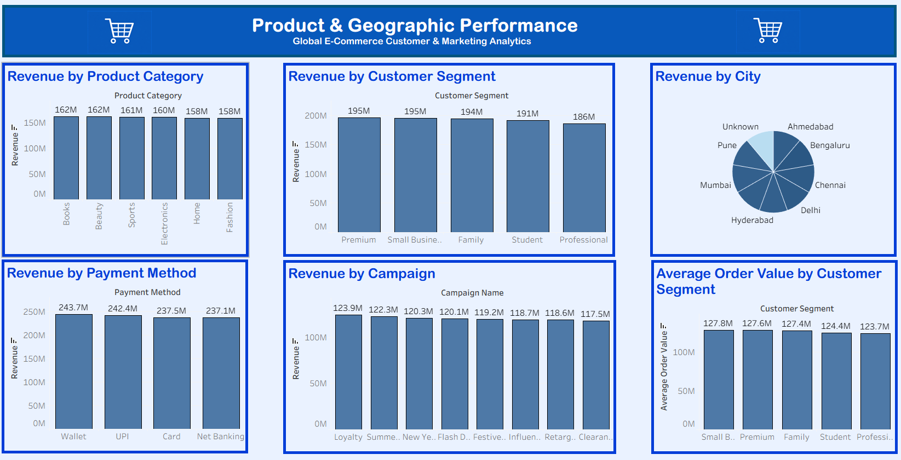

# Global E-Commerce Customer & Marketing Analytics

## Project Overview

This project analyzes global e-commerce customer, marketing, sales, and transaction data to identify business performance trends and customer behavior.

The project uses SQL for data analysis and Tableau for interactive business dashboards.

## Tools Used

- SQL (PostgreSQL)
- Tableau
- GitHub

## Key Areas of Analysis

- Revenue and order performance
- Marketing channel performance
- Product category performance
- Customer segment analysis
- Geographic performance
- Payment method analysis
- Campaign performance
- Average Order Value (AOV)
- Customer loyalty and engagement
- Customer churn

## Tableau Dashboards

### 1. Executive Business Overview

Provides a high-level view of:

- Total Revenue
- Total Orders
- Total Transactions
- Total Marketing Spend
- Revenue trends over time
- Marketing channel performance

### 2. Product & Geographic Performance

Analyzes:

- Revenue by Product Category
- Revenue by Customer Segment
- Revenue by City
- Revenue by Payment Method
- Revenue by Campaign
- Average Order Value by Customer Segment

## Project Objective

The objective of this project is to transform raw e-commerce data into meaningful business insights using SQL and Tableau, helping understand sales performance, marketing effectiveness, customer behavior, and business trends.

## Author

Created as a portfolio project for demonstrating SQL and Tableau analytics skills.
